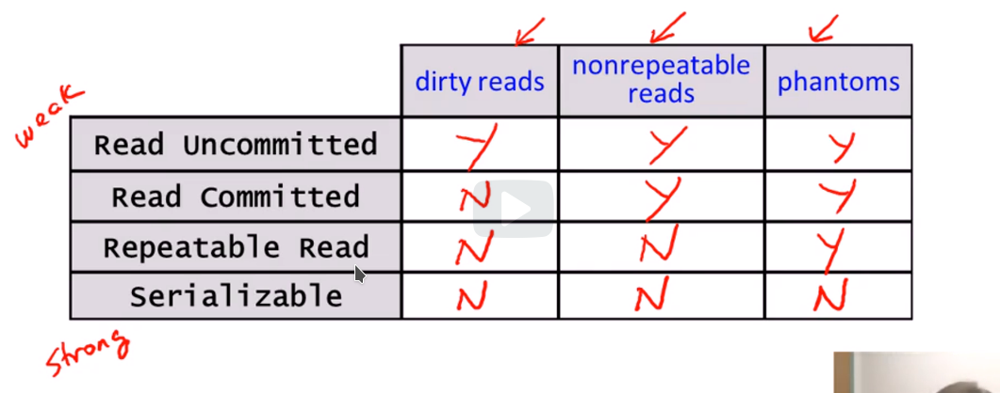

// suppress inspection "SqlDialectInspection" for whole file
// suppress inspection "SqlNoDataSourceInspection" for whole file
= SQL
:toc:

== Indexes
Struktura używana przez bazę danych pomagająca przyspieszyć działanie wyszukiwania. Może być tworzona na dowolnej liczbie kolumn. Jeżeli indeks jest na mniejszej liczbie kolumn niż w query to i tak zostanie użyty. Jest on także używany przy join. Niektóre systemy posiadają "physical design advisor", który proponuje najlepsze indeksy.

=== Drawbacks
- Zajmują dodatkowe miejsce
- Wymagają sporo czasu do stworzenia
- Dodawanie nowych wierszy jest dłuższe z powodu aktualizacji indeksu.

=== SQL syntax
[source,sql]
----
create index IndexName on T(A);
create index IndexName on T(A1, A2, An);
create unique index IndexName on T(A); -- nie mogą istnieć zduplikowane wartości w kolumnie A
drop index IndexName;
----

== Transactions
Zbiór żądań SQL, które mają być traktowane jako jednostka. Oznacza to, że są one wywoływane w izolacji i, albo wszystkie przejdą, albo, w przypadku błędu, wszystkie zostaną wycofane. Zgodnie ze standardem jedną transakcją jest zbiór żądań między komendami `commit`. Użytkownik może sam wykonać `rollback`. Transakcje nie powinny czekać zbyt długo (np. na input).

=== Properties
- Atomicity — albo wszystkie zmiany, albo żadne.
- Consistency — constraints w ramach danej bazy są zawsze poprawne.
- Isolation — każdy klient wydaje się działać w izolacji. Równoległe wykonywanie instrukcji wewnątrz transakcji, ale transakcje kolejno (serializability), nie znamy tej kolejności.
- Durability — jeżeli crash jest po `commit`, to wszytko przed zostaje w bazie.

=== Isolation level

Im niżej tym silniejsza izolacja (większy overhead, mniejsza concurrency i większa zapewnienie consistency). Ustawiamy per transakcja. Dirty read to taki, gdy dane są brane, zanim jeszcze zostały skomitowane.

- Read uncommitted — transakcja może przeprowadzić dirty reads.
- Read committed — transakcja nie może przeprowadzić dirty reads, ale jedna część może się wykonać przed całą, a druga po całej innej transakcji.
- Repeatable read — nie może przeprowadzić dirty reads, a dodatkowo przy wielokrotnym odczycie jednej wartości, nie może się ona zmienić. Mogą być problemy z phantom tuples, czyli takimi, które są insert/delete w trakcie transakcji, ponieważ ten stopień nie zapewnia nam, że zostaną one uwzględnione.
- serializable

==== How to specify?
[source, sql]
----
set transaction isolation level read uncommitted;
set transaction isolation level read committed;
set transaction isolation level repeatable read;
set transaction isolation level serializable; -- default
----

==== Read only transactions
Możemy tak określić transakcję. Jest wskazówką dla silnika.
[source, sql]
----
set transaction read only;
----

== Constraints and triggers
Constraints dbają, aby stan bazy był dopuszczalny, sprawdzane przy modyfikacjach tabeli (lub po transakcjach). Triggers monitorują zmiany, sprawdzają warunki i rozpoczynają akcje.

=== Trigger
Kiedy coś się stanie, to sprawdza warunek, i kiedy ok to coś robi. Możemy przenieść logikę z aplikacji. Możemy też ich użyć, aby dać constraints, które nie są zaimplementowane.
[source, sql]
----
create trigger name [before | after | instead of] events [referencing-variables] [for each row] when [condition] action
----

=== Constraints
- not null
- primary key — może być tylko jeden, w innych możemy wykorzystać `unique`, aby kombinacja była unikalna należy primary key (attr1, attr2, ...)
- attribute-based — sprawdza warunek dla danego atrybutu, po typie dajemy `check(condition)`, żaden dbms nie wspiera sub-query w nich
- tuple-based — jak w attribute, ale sprawdza kilka wartości i check dajemy po wszystkich kolumnach
- general assertions - aktualnie nie są zaimplementowane, jakiś condition, który zawsze musi być spełniony
